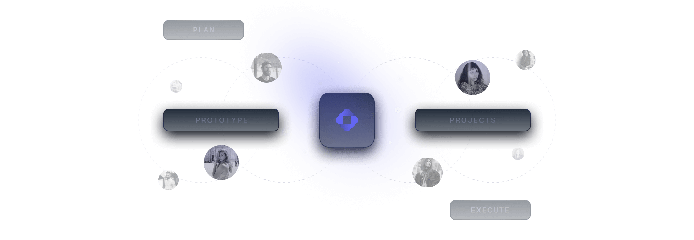

# 🚀 Free React / Next.js Landing Page Template (Customized Edition)



**Open** is a **free React / Next.js landing page template built with Tailwind CSS** for developers/makers who want to create a quick and professional landing page for their open-source projects, SaaS products, online services, and more.

> 🛠️ **Custom Enhancements Included:** > * **Non-Stop Workflows Marquee**: Modified the workflow pipeline tracking carousel to flow continuously *without* pausing or breaking motion on cursor hover elements.
> * **Full-Bleed Canvas Features Section**: Restructured layout boxes to expand showcase graphics to $100\%$ full screen view width seamlessly on all modern devices with edge-to-edge visibility.

---

## 🔗 Live Links & Extras

* **Live Demo:** Check the core live demo here 👉️ [https://open.cruip.com/](https://open.cruip.com/)
* **Design Assets:** If you need the original design systems, download them from Figma's Community Hub 👉️ [https://bit.ly/401KSUS](https://bit.ly/401KSUS)

Want more components, layouts, and pages? Upgrade to [Open PRO](https://cruip.com/) for a fully production-ready SaaS landing page machine.

---

## 🛠️ Usage & Local Development

This is a [Next.js](https://nextjs.org/) project bootstrapped with [`create-next-app`](https://github.com/vercel/next.js/tree/canary/packages/create-next-app) utilizing App Router (`app/`) architectures.

### Getting Started

First, run the development server setup matching your package manager preference:

```bash
npm run dev
# or
pnpm dev (recommended)
# or
yarn dev
